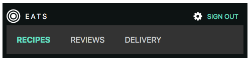

#MEAN Session Two

Python Simple Server `python -m SimpleHTTPServer <port>`

##SASS

* error checking - watch out for this
* variables - added padding and breakpoint
* imports and structure

[Bootstrap SASS](https://github.com/twbs/bootstrap-sass)

##Responsive

* Mobile first design
* Use min-width media queries to add features to larger screens `@media (min-width: 46.25em) { }`
* Use the meta tag `<meta name="viewport" content="width=device-width, initial-scale=1.0">` to ensure this works on devices 

[Viewport Demo for Phone](http://daniel.deverell.com/css-files/responsive-meta-example/)

##GIT and GITHUB

Git Config (typically only need to do this once on your machine)
```
git config
git config --global user.name "DannyBoyNYC"
git config --global user.email "daniel.deverell@gmail.com"
git config --list
```
* make sure terminal is in the correct directory
```
git init
```
Examine the .git Directory
```
ls -al
cd .git
ls
cd ..
```
Git Status
```
git status
On branch master
```
Git doesn't auto track files - only those you tell it to. Adding files creates untracked files. Create and add .gitignore run status.
```
git status
git commit -m 'initial commit'
```
Note: By default `git commit` goes into VIM. Avoid this (unless you like VM). If this happens, hit ESC and type “:q” to exit.

```
git status
On branch master
nothing to commit, working directory clean
```
```
git branch
git branch <branchname>
git checkout <branchname>
git diff
```
To merge branches 
* be in the branch you want to merge to
* run status on that branch to make sure nothing is odd
```
git checkout master
git status
git merge <branchname>
```
Other useful branch commands (delete, show unmerged and merged branches)
```
git branch -d <branchname>
git branch --no-merge
git branch --merged
```
Pushing Files to Remote Repos - Github
* Copy URL from github.
```
git remote add origin https://github.com/.../...
git push -u origin master
```

##FlexBox
* CSS Flexible Box Layout Module
* A simple guide to the various CSS properties on [CSS Tricks](https://css-tricks.com/snippets/css/a-guide-to-flexbox/)

###A simple Flex Nav



```
@import url(https://fonts.googleapis.com/css?family=Roboto:400,700);

body {
  font-family: 'Roboto', sans-serif;
  font-family: -apple-system, BlinkMacSystemFont, "Segoe UI", Roboto, Helvetica, Arial, sans-serif, "Apple Color Emoji", "Segoe UI Emoji", "Segoe UI Symbol";
}

.site-header {
  background: #0D1313;
  color: white;
  display: flex;
  align-items: center;
  padding:0.5rem;
}

.logo {
  text-decoration: none;
  color: white;
  font-size: 0.9rem;
  text-transform: uppercase;
  letter-spacing: 3px;
  padding: 10px;
}

.site-nav {
  ul {
    list-style: none;
    display: flex;
    margin: 0;
    padding: 0;
  }
  a {
    text-transform: uppercase;
    text-decoration: none;
    color: #CDD0D0;
    padding: 20px;
    display: inline-block;
  }
  .active {
    a {
      font-weight: bold;
      color: #62DEBE;
      background: darken(#62DEBE, 40%);
    }
  }
}

.account-actions {
  margin-left: auto;
  display: flex;
  align-items: center;
  margin-right: 10px;
}

.account-dropdown {
  ul {
    display: none;
  }
}

.sign-out-link {
  color: #62DEBE;
  font-size: 0.8rem;
  margin-left: 10px;
  text-transform: uppercase;
}

@media (max-width: 600px) {
  .site-header {
    flex-wrap: wrap;
  }
  .site-nav {
    order: 2;
    background: #333;
    width: 100%;
  }
}
```
[Font Awesome](http://fontawesome.io/)
```

<link rel="stylesheet" href="font-awesome-4.6.3/css/font-awesome.min.css">

<i class="fa fa-bullseye fa-3x"></i>

<i class="fa fa-gear"></i>

```
##SVG
[The spec](https://developer.mozilla.org/en-US/docs/Web/SVG/Element) and Mozilla docs

`<use>` `<viewBox>`

https://icomoon.io

http://responsivelogos.co.uk

http://www.svgeneration.com/recipes/Beam-Center/

###SASS responsive design of new navbar with SVG


Add a new SASS file to the imports and use the following:

```

.main-nav {
  background: #eee;
  margin-bottom: 1em;
  ul {
    display: flex;
    flex-wrap: wrap;
    justify-content: center;
  }
  a {
    padding: 1.25rem 0.5rem;
    font-size: 1rem;
    max-width: 140px;
    font-weight: bold;
    display: flex;
    align-items: flex-start;
    color: $reddish;
    background-color: $tan;
    &:hover, &:focus {
      background-color: $reddish;
      color: $white;
      svg {
        fill: $white; 
      }
      span {
        color: $white; 
      }
    }
  }
  span {
    display: block;
    font-size: 0.875rem;
    font-weight: normal;
    color: #888;
    margin: 0.25rem 0 0 0;
  }
  .icon {
    width: 40px;
    height: 40px;
    float: left;
    margin-right: 1rem;
    fill: #999;
  }
  &.outlines {
    * {
      outline: 1px solid rgba(red, 0.5); 
    }
  }
}

@media (min-width: $break-one) {
  .main-nav {
    a {
      max-width: 500px;
      font-size: 1.5rem; 
    }
    .icon {
      width: 25px;
      height: 25px;
    }
    .fa {
      font-size: 2rem;
  }
  }
}

```

Check that we are all using the CSS-based navigation 

```
<body class="p-cuisines">

<li><a class="t-cuisines" href="#">Cuisines</a></li> 
<li><a class="t-recipes" href="#">Recipes</a></li>

.p-cuisines .t-cuisines { 
  color: #fff; 
  background:#600; 
} 
```

##Second Page

###Static Pages
* static app - anchor in browser > request to server > database > html > browser
* AJAX - ability to refresh data after the app is running (mapquest vs google maps)
* Progressive enhancement - a trap?
* Spaghetti Javascript - code modifies existing DOM vs code that creates the DOM
* Mobile native (receives json) vs browser native (receives html)

###Thick client
* Modern web architecture - browser requests html > page contains JS that builds the base structure > ajax loads content via json > JS modifies DOM to present content.
* Benefits - same code for mobile and web, performance leverages the client (distributed), standardization on JS, html and css, speed and increased modularity.
* Routing

##Homework

1. Run through this [GIT exercise](https://try.github.io/levels/1/challenges/1) 
2. Create a repo on your local machine using the homework from session one. Push it to your Github account. 
3. Add a branch, use Flexbox on your navbar (or another part of your page if desired) and push this branch to  your Github account.
4. Add SVG elements to your page. (Use icomoon if you don't have any image apps.)
5. Add a carousel to the review in last week's homework.

##Reading
[You Don't Know JS](You Don't Know JavaScript)
[Chapter 1](https://github.com/getify/You-Dont-Know-JS/blob/master/up%20%26%20going/ch1.md)
[Chapter 2](https://github.com/getify/You-Dont-Know-JS/blob/master/up%20%26%20going/ch2.md)

###Suggested Reading
The Document Object Model [quick reference](http://javascript.info/tutorial/dom)
Chris Coyier - [Practical SVG](https://abookapart.com/products/practical-svg)
David Demaree - [GIT For Humans](https://abookapart.com/products/git-for-humans)

$ PORT=4000 node app/app.js


